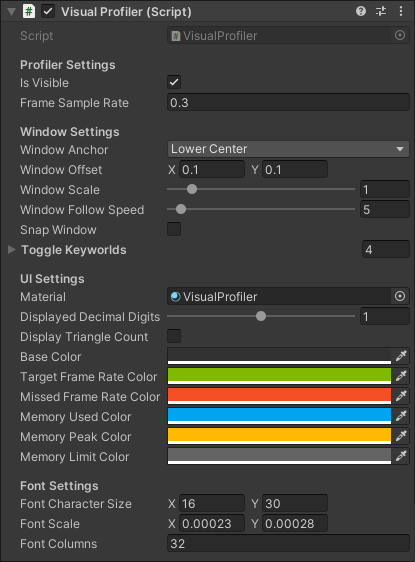

# Visual Profiler

The Visual Profiler provides a drop in solution for viewing your mixed reality Unity application's frame rate, scene complexity, and memory usage across a variety of platforms.

Missed frames are displayed over time to visually find problem areas. Scene complexity is reported in the form of draw calls and rendered vertex counts. Memory is reported as current, peak and max usage in a bar graph.

> [!NOTE]
> To ensure the profiler is minimally intrusive it does not create any game objects, perform any per frame managed allocations, and renders in a single draw call.

The Visual Profiler has been verified to work on the following platforms:

- Microsoft HoloLens & HoloLens 2
- Microsoft Immersive headsets (IHMD)
- OpenXR platforms
- Steam VR (HTC Vive / Oculus Rift)
- Meta Quest & Quest 2
- WebGL

## Installation

The Visual Profiler is normally ingested as a Unity [package](https://docs.unity3d.com/Manual/Packages.html). To import the Visual Profiler package into your Unity project follow the below steps:

> [!NOTE]
> The Visual Profiler package requires Unity 2020.x and above.

1. Open your Unity project and select `Window > Package Manager` from the file menu bar

2. Click the `'+'` icon within the Package Manager and select `"Add package from git URL..."`

    

3. Paste *https://github.com/microsoft/VisualProfiler-Unity.git#v2.0.0* into the text field and click `"Add"`

    

4. The Visual Profiler will now be installed within your Unity project as an immutable package within the project's `Packages` folder named `Mixed Reality Visual Profiler`.

5. Finally, add the VisualProfiler component to any GameObject in the Unity scene you wish to profile. The profiler is initially active and visible (toggle-able via the IsVisible property), but can be toggled via the enabled/disable voice command keywords (on Windows/UWP platforms only).

It is advised you use a specific release of the Visual Profiler package to ensure your project is locked to a stable release. Release version 2.0.0 is suggested in step three above. You can also pull another version, specific branch, or git commit hash by altering the URL as demonstrated below:

| Syntax           | URL example                                                                                                                                               |
|------------------|-----------------------------------------------------------------------------------------------------------------------------------------------------------|
| Specific version | *https://github.com/microsoft/VisualProfiler-Unity.git#vX.Y.Z*                                   |
| Specific branch  | *https://github.com/microsoft/VisualProfiler-Unity.git#my_branch*                                |
| Git commit hash  | *https://github.com/microsoft/VisualProfiler-Unity.git#badc0ffee0ddf00ddead10cc8badf00d1badb002* |

## Usage

When using the profiler look for "missed frames" which appear as orange bars. Missed frames indicate your application is not hitting its target frame rate and may need optimization work. Draw call counts and vertex counts are also displayed under the missed frame indicators. These numbers can be indicative of why your app isn't meeting its target frame rate.

One should also keep an eye on the bottom memory bar to insure memory usage isn't rapidly changing or approaching the application's memory limit.

> [!NOTE]
> The Visual Profiler works in both development and release builds.

The profiler UI (such as anchoring, scale, follow behavior and UI color) can also be tweaked in the component inspector.

## Feedback

To file issues or suggestions, please use the [Issues](https://github.com/Microsoft/VisualProfiler/issues) page for this project on GitHub.

## Contributing

This project welcomes contributions and suggestions. Most contributions require you to agree to a
Contributor License Agreement (CLA) declaring that you have the right to, and actually do, grant us
the rights to use your contribution. For details, visit https://cla.microsoft.com.

When you submit a pull request, a CLA-bot will automatically determine whether you need to provide
a CLA and decorate the PR appropriately (e.g., label, comment). Simply follow the instructions
provided by the bot. You will only need to do this once across all repos using our CLA.

This project has adopted the [Microsoft Open Source Code of Conduct](https://opensource.microsoft.com/codeofconduct/).
For more information see the [Code of Conduct FAQ](https://opensource.microsoft.com/codeofconduct/faq/) or
contact [opencode@microsoft.com](mailto:opencode@microsoft.com) with any additional questions or comments.
